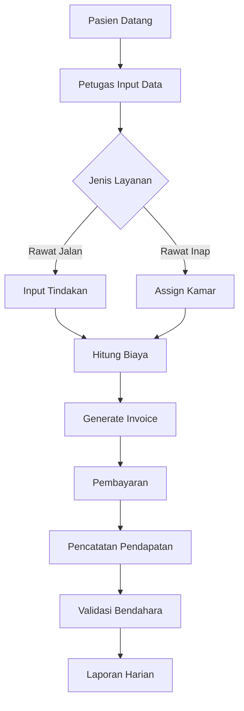
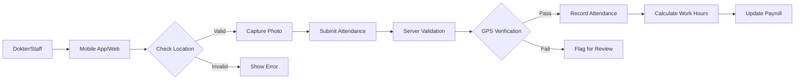
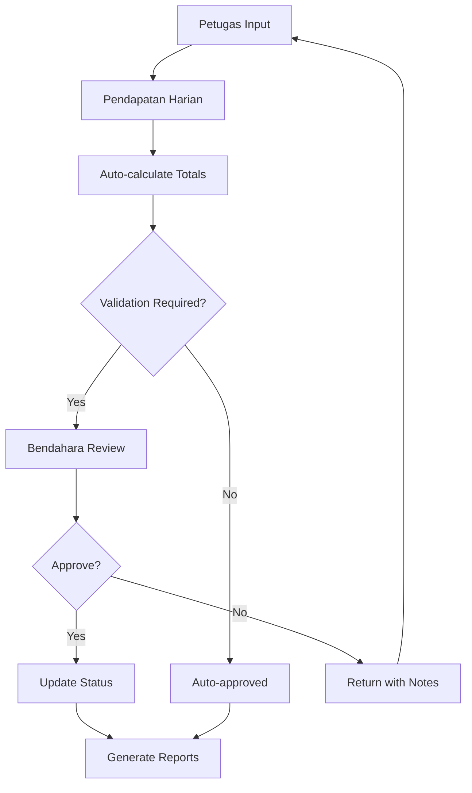
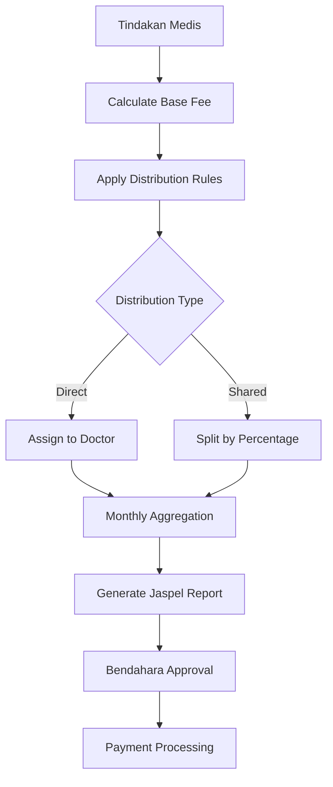

# Dokterku Application Flow Documentation

## 🏥 Sistem Overview

Dokterku adalah sistem manajemen klinik/rumah sakit komprehensif yang dibangun dengan Laravel + Filament, dirancang untuk mengelola operasional medis, keuangan, dan administrasi dengan multi-role access control.

## 📊 Arsitektur Aplikasi

### Tech Stack
- **Backend**: Laravel 11.x dengan Filament 3.x
- **Frontend**: Blade Templates, Livewire, Alpine.js
- **Database**: MySQL/PostgreSQL
- **Authentication**: Laravel Sanctum (API), Filament Auth (Web)
- **Real-time**: Laravel Echo dengan Pusher/Soketi
- **Queue**: Redis + Laravel Horizon
- **Cache**: Redis
- **Storage**: S3-compatible (Minio/AWS S3)

### Multi-Panel Architecture
```
┌─────────────────────────────────────────────┐
│            Aplikasi Dokterku                │
├─────────────────────────────────────────────┤
│  ┌──────────┐  ┌──────────┐  ┌──────────┐  │
│  │  Admin   │  │ Petugas  │  │Bendahara │  │
│  │  Panel   │  │  Panel   │  │  Panel   │  │
│  └──────────┘  └──────────┘  └──────────┘  │
│         │            │             │        │
│         └────────────┴─────────────┘        │
│                      │                      │
│            ┌─────────────────┐              │
│            │  Core Services  │              │
│            └─────────────────┘              │
│                      │                      │
│            ┌─────────────────┐              │
│            │    Database     │              │
│            └─────────────────┘              │
└─────────────────────────────────────────────┘
```

## 🔑 Role & Permission System

### User Roles
1. **Admin** (`/admin`)
   - Full system access
   - User management
   - System configuration
   - Master data management

2. **Petugas** (`/petugas`)
   - Input transaksi harian
   - Pencatatan tindakan medis
   - Presensi dokter
   - Data pasien

3. **Bendahara** (`/bendahara`)
   - Validasi keuangan
   - Laporan finansial
   - Manajemen Jaspel
   - Audit trail

### Permission Matrix
```
Feature              | Admin | Petugas | Bendahara
---------------------|-------|---------|----------
User Management      |   ✓   |    ✗    |     ✗
Transaksi Input      |   ✓   |    ✓    |     ✗
Financial Validation |   ✓   |    ✗    |     ✓
Report Generation    |   ✓   |    ○    |     ✓
System Config        |   ✓   |    ✗    |     ✗

✓ = Full Access, ○ = Limited Access, ✗ = No Access
```

## 💼 Core Business Flows

### 1. Daily Transaction Flow


### 2. Attendance (Presensi) Flow


### 3. Financial Validation Flow


### 4. Jaspel (Fee Distribution) Flow


## 📁 Database Structure

### Core Tables
```sql
-- Users & Authentication
users                   -- User accounts
model_has_roles        -- Role assignments
model_has_permissions  -- Direct permissions

-- Medical Operations
jumlah_pasien_harians  -- Daily patient counts
tindakans              -- Medical procedures
pendapatan_harians     -- Daily revenue
pengeluaran_harians    -- Daily expenses

-- Attendance & HR
presensis              -- Attendance records
shifts                 -- Work shifts
perizinan_cutis        -- Leave requests

-- Financial
jaspel_dokters         -- Doctor fee distributions
validasi_keuangans     -- Financial validations
laporan_keuangans      -- Financial reports

-- Master Data
dokters                -- Doctor profiles
pegawais               -- Staff profiles
units                  -- Department/units
kategoris              -- Categories
```

### Key Relationships
- User → hasMany → Roles
- Dokter → hasMany → Tindakan
- Tindakan → belongsTo → JumlahPasienHarian
- PendapatanHarian → hasOne → ValidasiKeuangan
- Presensi → belongsTo → User
- JaspelDokter → belongsTo → Dokter

## 🛠️ Development Guide

### Setting Up New Features

#### 1. Creating a New Resource
```php
// app/Filament/Resources/NewResource.php
class NewResource extends Resource
{
    protected static ?string $model = Model::class;
    protected static ?string $navigationIcon = 'heroicon-o-rectangle-stack';
    
    public static function form(Form $form): Form
    {
        return $form->schema([
            // Define form fields
        ]);
    }
    
    public static function table(Table $table): Table
    {
        return $table->columns([
            // Define table columns
        ]);
    }
}
```

#### 2. Adding Panel-Specific Features
```php
// app/Providers/Filament/PanelNamePanelProvider.php
public function panel(Panel $panel): Panel
{
    return $panel
        ->id('panel-name')
        ->path('panel-name')
        ->colors([...])
        ->discoverResources(in: app_path('Filament/PanelName/Resources'))
        ->middleware([...])
        ->authMiddleware([...]);
}
```

#### 3. Implementing Validation Workflow
```php
// Model with validation trait
use App\Traits\HasValidation;

class DailyTransaction extends Model
{
    use HasValidation;
    
    protected $validationRules = [
        'amount' => 'required|numeric|min:0',
        'validated_by' => 'nullable|exists:users,id',
        'validated_at' => 'nullable|datetime'
    ];
}
```

### API Integration Points

#### Authentication
```php
// routes/api.php
Route::post('/login', [AuthController::class, 'login']);
Route::post('/logout', [AuthController::class, 'logout'])->middleware('auth:sanctum');

// Protected routes
Route::middleware('auth:sanctum')->group(function () {
    Route::apiResource('patients', PatientController::class);
    Route::post('attendance/check-in', [AttendanceController::class, 'checkIn']);
});
```

#### Mobile App Integration
```php
// Key endpoints for mobile
POST   /api/v1/auth/login
POST   /api/v1/attendance/check-in
GET    /api/v1/dashboard/stats
GET    /api/v1/transactions/daily
POST   /api/v1/transactions/create
```

## 🚀 Deployment Architecture

### Production Environment
```yaml
# docker-compose.production.yml
services:
  app:
    image: dokterku:latest
    environment:
      - APP_ENV=production
      - QUEUE_CONNECTION=redis
      - CACHE_DRIVER=redis
      
  nginx:
    image: nginx:alpine
    volumes:
      - ./nginx.conf:/etc/nginx/nginx.conf
      
  redis:
    image: redis:alpine
    
  mysql:
    image: mysql:8.0
    environment:
      - MYSQL_DATABASE=dokterku
      
  horizon:
    image: dokterku:latest
    command: php artisan horizon
```

### Scaling Considerations
1. **Database**: Read replicas untuk report queries
2. **Cache**: Redis cluster untuk high availability
3. **Storage**: S3/Minio untuk file uploads
4. **Queue**: Horizon dengan multiple workers
5. **Load Balancing**: Nginx/HAProxy untuk distribusi traffic

## 🔒 Security Implementation

### Authentication Layers
1. **Web**: Session-based dengan Filament Guards
2. **API**: Token-based dengan Laravel Sanctum
3. **2FA**: Optional TOTP implementation ready

### Data Protection
- **Encryption**: Sensitive data encrypted at rest
- **Audit Trail**: Semua perubahan data tercatat
- **Rate Limiting**: API throttling implemented
- **CORS**: Configured untuk mobile app domains
- **XSS/CSRF**: Laravel built-in protections

## 📊 Monitoring & Logging

### Application Monitoring
```php
// Telescope untuk development
// Sentry untuk production error tracking
// Custom logging channels

Log::channel('financial')->info('Transaction validated', [
    'transaction_id' => $id,
    'validated_by' => auth()->id(),
    'amount' => $amount
]);
```

### Performance Metrics
- Response time monitoring
- Database query optimization
- Queue job processing times
- Cache hit rates
- API endpoint usage

## 🎯 Best Practices

### Code Organization
1. **Single Responsibility**: Setiap class punya satu tujuan
2. **Repository Pattern**: Untuk complex queries
3. **Service Layer**: Business logic terpisah dari controllers
4. **Form Requests**: Validation logic terpusat
5. **Resources**: API response formatting konsisten

### Database Optimization
1. **Indexing**: Pada foreign keys dan frequently queried columns
2. **Eager Loading**: Prevent N+1 queries
3. **Query Scopes**: Reusable query constraints
4. **Soft Deletes**: Untuk data audit trail

### Testing Strategy
```bash
# Unit Tests
php artisan test --filter=Unit

# Feature Tests  
php artisan test --filter=Feature

# Browser Tests (Dusk)
php artisan dusk
```

## 📝 Common Development Tasks

### Adding New Transaction Type
1. Create migration untuk table baru
2. Generate Model dengan relationships
3. Create Filament Resource
4. Add validation rules
5. Implement approval workflow if needed
6. Add to reporting system

### Extending User Roles
1. Add role di database seeder
2. Create new Panel Provider
3. Configure middleware & guards
4. Set navigation items
5. Define permissions matrix

### Integrating External Service
1. Create service class di `app/Services`
2. Add configuration di `config/`
3. Implement interface untuk flexibility
4. Add ke Service Provider
5. Create facade if needed

## 🔄 Maintenance Procedures

### Daily Tasks
- Check queue job failures
- Monitor error logs
- Verify backup completion

### Weekly Tasks
- Database optimization
- Clear old cache entries
- Review security logs

### Monthly Tasks
- Update dependencies
- Performance analysis
- Security audit

## 📚 Additional Resources

### Internal Documentation
- `/docs/api` - API documentation
- `/docs/database` - Database schema details
- `/docs/deployment` - Deployment guides

### External Dependencies
- [Laravel Documentation](https://laravel.com/docs)
- [Filament Documentation](https://filamentphp.com/docs)
- [Livewire Documentation](https://livewire.laravel.com/docs)

