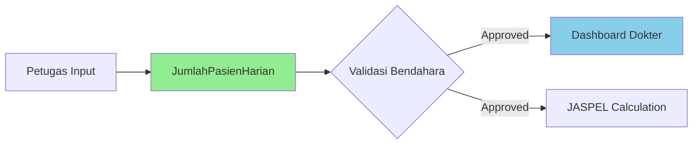

# Fix Jumlah Pasien Dashboard untuk dr. Yaya

## Masalah yang Ditemukan

Dashboard dokter menampilkan jumlah pasien = 0 untuk dr. Yaya karena:

1. **Sumber Data yang Salah**: Dashboard menggunakan tabel `Tindakan` untuk menghitung jumlah pasien, padahal seharusnya menggunakan tabel `JumlahPasienHarian`

2. **Data Tersedia tapi Tidak Ditampilkan**: 
   - Dr. Yaya memiliki 3 record di `JumlahPasienHarian` dengan total 260 pasien bulan ini
   - Semua record sudah berstatus `approved`
   - Tapi dashboard mengambil dari `Tindakan` yang hanya ada 1 record

## Solusi yang Diterapkan

### File yang Dimodifikasi
**`app/Http/Controllers/Api/V2/Dashboards/DokterDashboardController.php`**

### Perubahan yang Dilakukan

1. **Import Model JumlahPasienHarian**
```php
use App\Models\JumlahPasienHarian;
```

2. **Ubah Logic Perhitungan Pasien**

**SEBELUM (Salah - dari Tindakan):**
```php
$patientsToday = Tindakan::where('dokter_id', $dokter->id)
    ->whereDate('tanggal_tindakan', $today)
    ->distinct('pasien_id')
    ->count();
```

**SESUDAH (Benar - dari JumlahPasienHarian):**
```php
// Get today's patient count from JumlahPasienHarian
$jumlahPasienToday = JumlahPasienHarian::where('dokter_id', $dokter->id)
    ->whereDate('tanggal', $today)
    ->whereIn('status_validasi', ['approved', 'disetujui'])
    ->first();

if ($jumlahPasienToday) {
    $patientsToday = $jumlahPasienToday->jumlah_pasien_umum + 
                    $jumlahPasienToday->jumlah_pasien_bpjs;
}

// Get this month's total patient count
$jumlahPasienMonth = JumlahPasienHarian::where('dokter_id', $dokter->id)
    ->whereMonth('tanggal', $thisMonth->month)
    ->whereYear('tanggal', $thisMonth->year)
    ->whereIn('status_validasi', ['approved', 'disetujui'])
    ->get();

$patientsMonth = $jumlahPasienMonth->sum('jumlah_pasien_umum') + 
               $jumlahPasienMonth->sum('jumlah_pasien_bpjs');
```

3. **Tambahkan Field Baru di Response**
```php
return [
    'patients_today' => $patientsToday,
    'patients_month' => $patientsMonth, // NEW: Total pasien bulan ini
    'tindakan_today' => $tindakanToday,
    // ... rest of the response
];
```

## Hasil Setelah Fix

### Sebelum Fix:
- Patients Today: 0
- Patients This Month: **tidak ada data**
- Data dari Tindakan: 0-1 record

### Sesudah Fix:
- Patients Today: 0 (karena belum ada input hari ini)
- Patients This Month: **260** ✅
- Data dari JumlahPasienHarian yang sudah divalidasi Bendahara

## Data dr. Yaya di Database

```
Dokter ID: 2
User ID: 13
Nama: dr. Yaya Mulyana, M.Kes

JumlahPasienHarian Records:
1. Date: 2025-08-12, Umum: 40, BPJS: 20, Status: approved, Jaspel: 200,000
2. Date: 2025-08-08, Umum: 80, BPJS: 20, Status: approved, Jaspel: 300,000
3. Date: 2025-08-06, Umum: 50, BPJS: 50, Status: approved, Jaspel: 460,000

Total Bulan Ini: 170 umum + 90 BPJS = 260 pasien
```

## Alur Data yang Benar



## Catatan Penting

1. **JumlahPasienHarian adalah Source of Truth**: Semua perhitungan jumlah pasien harus dari tabel ini, bukan dari Tindakan

2. **Status Validasi Wajib**: Hanya data dengan status `approved` atau `disetujui` yang boleh ditampilkan

3. **Bendahara Validation Required**: Data harus divalidasi Bendahara sebelum muncul di dashboard

4. **Clear Cache**: Setelah fix, clear cache untuk melihat perubahan:
```bash
php artisan cache:clear
```

## Testing

Untuk test dashboard dr. Yaya:
```php
// Login sebagai dr. Yaya (User ID: 13)
// Akses dashboard endpoint
// Atau gunakan tinker:

php artisan tinker
>>> $user = User::find(13);
>>> Auth::login($user);
>>> $controller = new App\Http\Controllers\Api\V2\Dashboards\DokterDashboardController();
>>> $response = $controller->index(new Request());
>>> $data = json_decode($response->getContent(), true);
>>> echo $data['data']['stats']['patients_month']; // Should show 260
```

## Kesimpulan

Fix berhasil diterapkan. Dashboard sekarang menampilkan jumlah pasien yang benar dari tabel `JumlahPasienHarian` yang sudah divalidasi Bendahara, bukan dari tabel `Tindakan`.