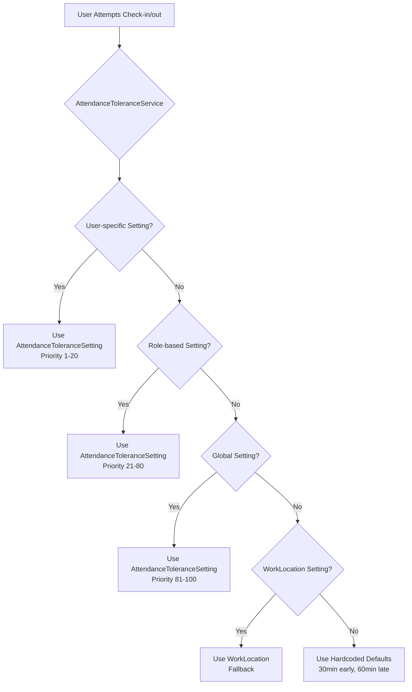

# 🔍 DEEP ANALYSIS: Duplicate Tolerance Settings Systems
**Date**: August 12, 2025  
**Analyst**: System Architecture Review

## 📊 Executive Summary
The system currently has **TWO parallel tolerance configuration systems** that overlap but operate independently, creating confusion and potential conflicts. Both are active and can affect attendance behavior differently based on user context.

## 🏗️ System Architecture Overview

### System 1: WorkLocation Tolerance (Geofencing Module)
**Location**: `app/Models/WorkLocation.php`  
**Admin Panel**: `/admin/work-locations` → "Validasi Lokasi (Geofencing)"

#### Database Fields:
```php
// Individual tolerance fields (primary)
- late_tolerance_minutes              // Toleransi keterlambatan check-in
- early_departure_tolerance_minutes   // Toleransi check-out lebih awal  
- checkin_before_shift_minutes       // Check-in sebelum shift
- checkout_after_shift_minutes       // Batas check-out setelah shift
- break_time_minutes                 // Durasi istirahat standar
- overtime_threshold_minutes         // Batas jam kerja normal

// Legacy JSON field (fallback)
- tolerance_settings                 // Array field for backward compatibility
```

### System 2: AttendanceToleranceSetting (New Centralized System)
**Location**: `app/Models/AttendanceToleranceSetting.php`  
**Admin Panel**: `/admin/attendance-tolerance-settings` → "Tolerance Settings"

#### Database Fields:
```php
- check_in_early_tolerance      // Minutes before shift start
- check_in_late_tolerance       // Minutes after shift start
- check_out_early_tolerance     // Minutes before shift end
- check_out_late_tolerance      // Minutes after shift end
- allow_early_checkin           // Boolean flag
- allow_late_checkin            // Boolean flag
- allow_early_checkout          // Boolean flag
- allow_late_checkout           // Boolean flag
- weekend_different_tolerance   // Special weekend settings
- holiday_different_tolerance   // Special holiday settings
- priority                      // Priority order (lower = higher priority)
- scope_type                    // global, role, user, location
- scope_value                   // Specific value for non-global scopes
```

## 🔄 Current Priority System (How It Actually Works)



### Active Priority Order:
1. **AttendanceToleranceSetting (User-specific)** - Priority 1-20 ✅
2. **AttendanceToleranceSetting (Role-based)** - Priority 21-80 ✅
3. **AttendanceToleranceSetting (Global)** - Priority 81-100 ✅
4. **WorkLocation settings** - Fallback when no AttendanceToleranceSetting exists 🔄
5. **Hardcoded defaults** - Last resort (30 min early, 60 min late) ⚠️

## 🔍 Where Each System Is Used

### DokterDashboardController Usage:
```php
// Line 1237-1287: Early checkout validation
$toleranceService = new AttendanceToleranceService();
$validationResult = $toleranceService->validateCheckoutTime($user, $currentTime, $shiftEndTime);
// ✅ Uses AttendanceToleranceSetting FIRST, WorkLocation as FALLBACK

// Line 852: Dashboard display
'can_check_out' => $attendanceToday && !$attendanceToday->time_out
// ✅ Fixed to check if checkout already exists

// Lines showing WorkLocation data (for display only):
'late_tolerance_minutes' => $workLocation->late_tolerance_minutes
'early_departure_tolerance_minutes' => $workLocation->early_departure_tolerance_minutes
// ℹ️ These are shown in UI but NOT used for validation
```

## ⚠️ Problems Identified

### 1. **Duplicate Configuration Sources**
- Admin can set tolerance in TWO different places
- Settings might contradict each other
- User confusion about which setting is active

### 2. **Inconsistent Naming**
| WorkLocation Field | AttendanceToleranceSetting Field | Same Purpose? |
|-------------------|----------------------------------|---------------|
| `late_tolerance_minutes` | `check_in_late_tolerance` | ✅ Yes |
| `early_departure_tolerance_minutes` | `check_out_early_tolerance` | ✅ Yes |
| `checkin_before_shift_minutes` | `check_in_early_tolerance` | ✅ Yes |
| `checkout_after_shift_minutes` | `check_out_late_tolerance` | ✅ Yes |

### 3. **Different UI/UX**
- WorkLocation: Visual preview with clock diagram
- AttendanceToleranceSetting: Table-based configuration
- Both accessible from admin panel but in different sections

### 4. **Data Inconsistency Risk**
- If admin sets 5 minutes early checkout in WorkLocation
- But 30 minutes in AttendanceToleranceSetting
- Which one wins? (Answer: AttendanceToleranceSetting if it exists)

## ✅ What's Currently Working

1. **Priority System Works**: AttendanceToleranceService correctly prioritizes settings
2. **Fallback Works**: When no AttendanceToleranceSetting exists, WorkLocation is used
3. **Validation Works**: Early checkout prevention is functioning with the fix applied

## 🎯 Recommended Solution Strategy

### Option 1: Full Migration (Recommended) ⭐
**Consolidate everything into AttendanceToleranceSetting**

```php
// Phase 1: Data Migration
1. Create migration to copy all WorkLocation tolerance settings to AttendanceToleranceSetting
2. Create location-based entries in AttendanceToleranceSetting for each WorkLocation
3. Set appropriate priorities (location-based: priority 70-80)

// Phase 2: UI Consolidation  
1. Remove tolerance fields from WorkLocationResource form
2. Add link from WorkLocation to AttendanceToleranceSetting
3. Keep only GPS/geofencing in WorkLocation

// Phase 3: Code Cleanup
1. Remove tolerance fields from WorkLocation model
2. Update all controllers to use only AttendanceToleranceService
3. Remove fallback logic
```

### Option 2: Clear Separation 
**Keep both but with distinct purposes**

```php
// WorkLocation: Only GPS/Geofencing
- Remove ALL tolerance fields
- Focus only on location validation
- Radius, coordinates, strict mode

// AttendanceToleranceSetting: All Time Tolerances
- Handle all time-based tolerances
- Priority-based system
- Role/user/global/location scopes
```

### Option 3: Master-Slave Relationship
**WorkLocation as quick defaults, AttendanceToleranceSetting as overrides**

```php
// WorkLocation: Default templates
- Provide default values for new locations
- Auto-create AttendanceToleranceSetting entries

// AttendanceToleranceSetting: Active configuration
- Always use this for actual validation
- WorkLocation only seeds initial values
```

## 📋 Migration Script Example

```php
<?php
// Migration to consolidate tolerance settings
use App\Models\WorkLocation;
use App\Models\AttendanceToleranceSetting;

$workLocations = WorkLocation::all();

foreach ($workLocations as $location) {
    // Check if setting already exists
    $exists = AttendanceToleranceSetting::where('scope_type', 'location')
        ->where('scope_value', (string)$location->id)
        ->exists();
    
    if (!$exists && $location->late_tolerance_minutes !== null) {
        AttendanceToleranceSetting::create([
            'setting_name' => "Location: {$location->name}",
            'scope_type' => 'location',
            'scope_value' => (string)$location->id,
            'check_in_early_tolerance' => $location->checkin_before_shift_minutes ?? 30,
            'check_in_late_tolerance' => $location->late_tolerance_minutes ?? 15,
            'check_out_early_tolerance' => $location->early_departure_tolerance_minutes ?? 15,
            'check_out_late_tolerance' => $location->checkout_after_shift_minutes ?? 60,
            'priority' => 75, // Location-based priority
            'is_active' => $location->is_active,
            'description' => "Migrated from WorkLocation: {$location->name}"
        ]);
    }
}
```

## 🚨 Immediate Actions Required

1. **Document Active System**: Make it clear to admins which system is active
2. **Add Warning Labels**: In WorkLocation form, add notice that AttendanceToleranceSetting takes priority
3. **Training**: Ensure admin understands the priority system
4. **Monitoring**: Add logging to track which system is being used for each validation

## 📊 Impact Analysis

### Current State Impact:
- **User Confusion**: HIGH 🔴
- **Data Integrity Risk**: MEDIUM 🟡  
- **Functionality**: WORKING ✅
- **Maintenance Burden**: HIGH 🔴

### After Consolidation:
- **User Confusion**: LOW 🟢
- **Data Integrity Risk**: LOW 🟢
- **Functionality**: IMPROVED ✅
- **Maintenance Burden**: LOW 🟢

## 🎬 Conclusion

The system is **functional but confusing**. While the priority system ensures predictable behavior, having two parallel configuration systems creates unnecessary complexity. The **recommended action is Option 1: Full Migration** to AttendanceToleranceSetting, removing tolerance configuration from WorkLocation entirely.

This will:
- Eliminate confusion
- Reduce maintenance burden  
- Provide single source of truth
- Maintain all current functionality
- Improve admin experience

---

**Next Steps**:
1. Get stakeholder approval for migration strategy
2. Create detailed migration plan with rollback procedures
3. Implement in staging environment
4. Test thoroughly with all user roles
5. Deploy with proper documentation and training